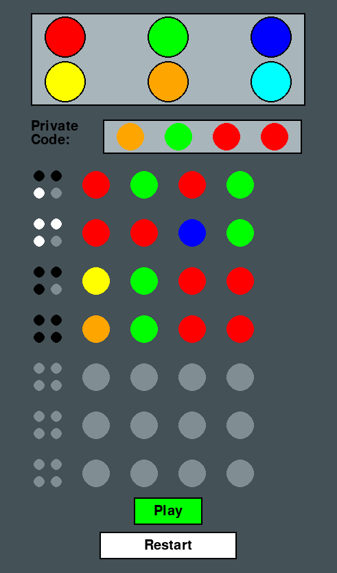

# MasterMind-AI

## The Team

- **Joren Vandewalle**
- **Sam De Wispelaere**
- **Niels Denoo**

## Objective

### Main Goal

- We aim to create an AI that can solve the 4 colors long code from a game of mastermind in the least possible moves.

### Sub Goals

- Make it visualized and not only in the console.
- Make a player versus player mode(can be in console).
- Document everything properly so other people can learn from our experience.

----

## Problems

1. What is Mastermind and what are the rules?
2. Who does what in the team?
3. How do we make the Mastermind game in code?
4. How do we make the AI to solve this?
5. How can we visualize this game?

----

### 1. Mastermind Game Rules

#### Objective

The goal of **Mastermind** is for the **codebreaker** to guess the secret code chosen by the **codemaker** in as few guesses as possible.

#### Players

- **Codemaker**: The player who creates the secret code.
- **Codebreaker**: The player who attempts to guess the secret code.

#### Setup

- The **codemaker** selects a secret code consisting of a sequence of colors.
- The **codebreaker** makes guesses about the secret code.
- **Colors**: Typically, there are 6 colors to choose from.
- **Positions**: The code consists of a set number of positions (usually 4 positions in a standard version).

#### Gameplay

1. **Codemaker's Role**:
   - The codemaker secretly selects a code.
   - Provides feedback on the codebreaker's guesses but does not reveal the code directly.

2. **Codebreaker's Role**:
   - The codebreaker makes guesses about the secret code.
   - After each guess, the codemaker provides feedback using **pegs**:
     - **Black Pegs**: Indicate a correct color in the correct position.
     - **White Pegs**: Indicate a correct color but in the wrong position.

3. **Feedback**:
   - The codemaker provides feedback after each guess, which helps the codebreaker refine their strategy.

##### Example

If the secret code is `(1, 2, 3, 4)` and the codebreaker guesses `(1, 3, 2, 4)`, the feedback might be:

- **2 black pegs** (because `1` and `4` are in the correct positions).
- **2 white pegs** (because `2` and `3` are the correct colors but in the wrong positions).

#### Winning the Game

The game ends when the codebreaker correctly guesses the secret code or when the codemaker decides to end the game.

### 2. Who does what in the team?

- **Joren Vandewalle:**
   - Visuals
   - Poweroint

- **Sam De Wispelaere:**
   - Coding the AI solver
   - Coding pvp mode
   - Documentatie

- **Niels Denoo**
   - Combining the visuals with the game
   - Coding pvp mode
   - Powerpoint
   - rapport

### 3. How do we make the Mastermind game in code?

For this we will start of by making an player versus player masterminde game. Just like the real game. For more info on the code we used for this press [here](./docs/Codes_Explained/PlayerVsPlayer.ipynb).The code itself can be found here [here](./PlayerVsPlayer/peoplePlay.py)

### 4. How do we make the AI to solve this?

#### Simple step by step

The following is a simple step-by-step explanation of how the algorithm finds the solution in a Mastermind game:

**Step 1:** To start, we make a list of all possible color combinations. (If we use 6 colors and 4, \(6^4 = 1296\) possible codes)

**Step 2:** Then we choose the best possible starting guess.

**Step 3:** After our first guess, we get feedback. If the feedback is 4 black pegs, the game is finished. If not, we continue.

**Step 4:** This step involves deciding which solutions are possible and which are not.For that we use **Knuth Algorythm** for more info, see [here](./docs/Knuth_Algorithm_Explained.md). Explaination for how we do that in code can be found [here](./docs/Codes_Explained/KnuthCodeExplained.ipynb)

**Step 5:** We eliminate all the codes that are no longer possible answers.

**Step 6:** Using the **min-max** strategy, we can make the best possible next guess to eliminate the maximum number of answers. For more info, see [here](./docs/MinMaxExplained.md). Do u want to know how we did that in code press. [here](./docs/Codes_Explained/MinMaxCodeExplained.ipynb)

----

### 5. How can we visualize this game?

#### What did we want

We wanted to make the game visualized so that it looks similar to the mastermind board game, but then in a more modern way. 
Mastermind board:

#### How did we do it

We used pygame to visualize the game, we added the color buttons to fill in the private code and added space for the guesses and feedback. We used buttons to play and restart the game.

##### Pygame

We used pygame to make the visualization. This is a python library that allows you to make games. We used it to make the game more interactive and fun. First we had to make a game window, we used a 500 by 850 size to get a more vertical game. Then we chose the styling like the background color, text size and color.

##### Colors buttons

We created buttons for each color so that the player can fill in the private code. When a color button is clicked, the color is added to the private code. 

##### Guesses and feedback

We tried to create the same layout as the mastermind board game. We added 4 big circles in the middle for the guesses, and on the side there are 4 smaller circles for the feedback pegs. When a guess is made, the guesses and the feedback are updated.

##### Play and restart buttons

The last thing we added was a play and restart button. This makes it easy for the player to start a new game or play again.

##### Problems we faced

We didnt know how pygame worked, so we had to find out how we would use it. The first styling we had was allot of hardcoded values, later on we changed the code and knwo it is more readable.

##### .exe file

To make it easy to play the game we also made an .exe file. This is done with the `pyinstaller` library. This library can convert python code into an .exe file. This will automatically install all the required libraries and only open up the main game without a console.

1. Install pyinstaller: `pip install pyinstaller`
2. Go to the file directory: `cd your/file/directory/`
3. Make the .exe file: `python -m PyInstaller --noconsole --onefile your_file_name.py`
4. You can find the .exe file in the **dist** folder.

##### Result

After allot of trying and testing we got a game that has allot of the same layout of the board game and it is easy to use. This is the result:

The code with first styling can be found [here](testVisual.py)

----

## Expantions

- We could make the PvP mode visualized aswell
- We could add a timers for how long the Algorithm takes to solve the code.
- We could make the AI so its maybe faster but it needs more guesses.

## Conclusion

- We made an AI that can solve Masterminde everytime in 5 or less guesses
- We visualized the game
- There is a player vs player mode
- There is a lot of documentation

So in the end i think we did everything we set out to do.

## Bibliografie

Knuth algorithm
[StackOverflow](https://stackoverflow.com/questions/62430071/donald-knuth-algorithm-mastermind)

Voorbeeld mastermind game
[Github](https://github.com/NathanDuran/Mastermind-Five-Guess-Algorithm)