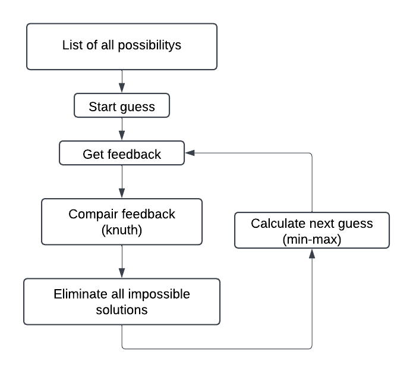

# MasterMind-AI

## The Team

- **Joren Vandewalle**
- **Sam De Wispelaere**
- **Niels Denoo**

## Objective
### Main objective
We aim to create an AI that can solve a game of masterminde in as least possible moves.
### Sub-objectives
- Make it visualized and not only in the console

## The Task

We aim to create an AI that can guess the correct 4-letter code representing colors, similar to the classic Mastermind game. The project will be developed using Python.

The game will first be implemented as a console version, and later it will be adapted to a visual format where users can select colors.

## Mastermind Game Rules

### Objective

The goal of **Mastermind** is for the **codebreaker** to guess the secret code chosen by the **codemaker** in as few guesses as possible.

### Players

- **Codemaker**: The player who creates the secret code.
- **Codebreaker**: The player who attempts to guess the secret code.

### Setup

- The **codemaker** selects a secret code consisting of a sequence of colors.
- The **codebreaker** makes guesses about the secret code.
- **Colors**: Typically, there are 6 colors to choose from.
- **Positions**: The code consists of a set number of positions (usually 4 positions in a standard version).

### Gameplay

1. **Codemaker's Role**:
   - The codemaker secretly selects a code.
   - Provides feedback on the codebreaker's guesses but does not reveal the code directly.

2. **Codebreaker's Role**:
   - The codebreaker makes guesses about the secret code.
   - After each guess, the codemaker provides feedback using **pegs**:
     - **Black Pegs**: Indicate a correct color in the correct position.
     - **White Pegs**: Indicate a correct color but in the wrong position.

3. **Feedback**:
   - The codemaker provides feedback after each guess, which helps the codebreaker refine their strategy.

#### Example

If the secret code is `(1, 2, 3, 4)` and the codebreaker guesses `(1, 3, 2, 4)`, the feedback might be:

- **2 black pegs** (because `1` and `4` are in the correct positions).
- **2 white pegs** (because `2` and `3` are the correct colors but in the wrong positions).

### Winning the Game

The game ends when the codebreaker correctly guesses the secret code or when the codemaker decides to end the game.

### Variations

- **Number of Colors**: The number of colors can vary, but typically there are 6 colors.
- **Number of Positions**: The code can have a varying number of positions (usually 4 or 5).
- **Difficulty**: The difficulty can be adjusted by changing the number of colors or positions.

### Player versus player

We have developed a simple demo for player versus player mode if you'd like to try the game for yourself.

[Try the player vs player](./PlayerVsPlayer/peoplePlay.py)

---

## Simple step by step

The following is a simple step-by-step explanation of how the algorithm finds the solution in a Mastermind game:

**Step 1:** To start, we make a list of all possible color combinations. (If we use 6 colors and 4, \(6^4 = 1296\) possible codes)

**Step 2:** Then we choose the best possible starting guess.

**Step 3:** After our first guess, we get feedback. If the feedback is 4 black pegs, the game is finished. If not, we continue.

**Step 4:** This step involves deciding which solutions are possible and which are not. For more info, see [here](./docs/Knuth_Algorithm_Explained.md).

**Step 5:** We eliminate all the codes that are no longer possible answers.

**Step 6:** Using the min-max strategy, we can make the best possible next guess to eliminate the maximum number of answers. For more info, see [here](./docs/MinMaxExplained.md).

---
